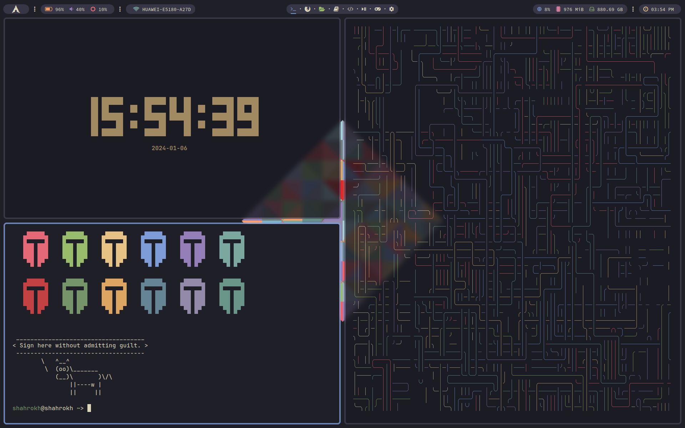

# Dotfiles

My dotfiles for [Arch Linux](https://archlinux.org/), using [BSPWM](https://github.com/baskerville/bspwm/), heavily inspired by [Axyl OS](https://axyl-os.github.io/), "a Linux distro centered on tiling window managers" - along with the installation process.

## Author

- **Pierre-Alain Castella** - _Initial work_ - [metapho-re](https://github.com/metapho-re)

## License

This project is licensed under the MIT License - see the [LICENSE](LICENSE) file for details.
